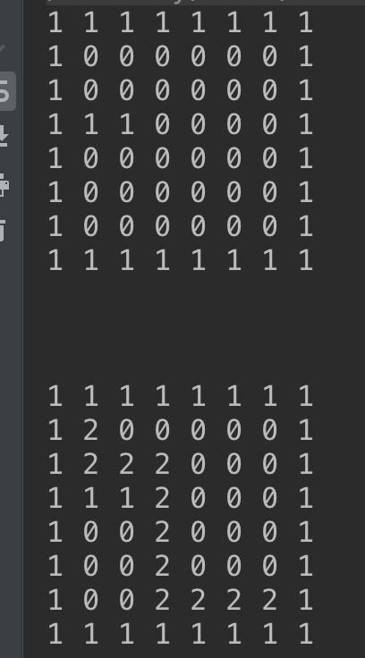

# 迷宫问题

```java

/**
 * 迷宫问题
 *
 * 在二维数组中，从一个点走到另一个点（0代表可走，1代表墙壁）
 *
 * @author yang
 * @date 2019/10/15
 */
public class Migong {

    public static void main(String[] args) {
        int [][] arr = new int[8][8];
        //设置围栏和障碍
        fence(arr);
        //打印数组
        print(arr);
        System.out.println( "\n\n" );
        //行走路线
        way(arr,1,1);
        //打印数组
        print(arr);


    }

    private static boolean way(int[][] arr, int i, int j) {
        if(arr[6][6] == 2){
            return true;
        }else {
            if(arr[i][j] == 0){
                //假设此点可走
                arr[i][j] = 2;
                //下
                if (way(arr,i+1,j)){
                    return true;
                    //右
                }else if (way(arr,i,j+1)){
                    return true;
                    //上
                }else if (way(arr,i-1,j)){
                    return true;
                    //左
                }else if (way(arr,i,j-1)){
                    return true;
                }else {
                    //此点不可走
                    arr[i][j] = 3;
                    return false;
                }
            }else {
                return false;
            }
        }


    }

    private static void print(int[][] arr) {
        for (int i = 0; i < arr.length; i++) {
            for (int j = 0; j < arr[i].length ; j++) {
                System.out.print(arr[i][j]+" ");
            }
            System.out.println();
        }
    }

    private static void fence(int[][] arr) {
        for (int i = 0; i < arr.length; i++) {
                arr[i][0] = 1;
                arr[i][7] = 1;
        }
        for (int i = 1; i < arr[0].length -1; i++) {
            arr[0][i] = 1;
            arr[7][i] = 1;
        }

        arr[3][1] = 1;
        arr[3][2] = 1;

    }

}

```

打印效果图：

