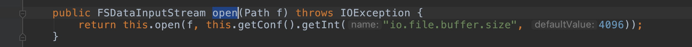
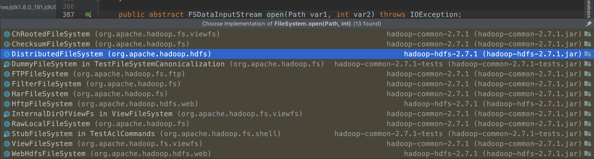
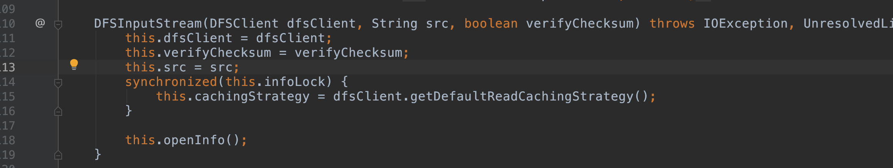
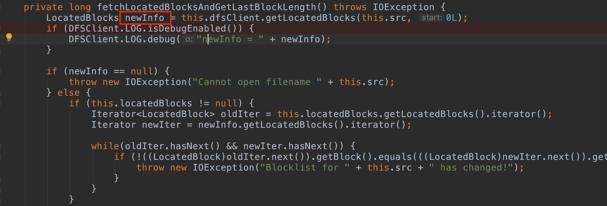

# java获取服务端datanode源码过程

## 1、进入open方法




## 2、在FileSystem中得到抽象方法，open（）具体实现为DistributeFileSystem类中



## 3、匿名实现类，执行该方法的doCall方法


## 4、进入 new DFSInputStream中读取文件


## 5、进入openInfo（）



## 6、进入fetchLocateBlocksAndGetLastBlockLength（）方法


## 7、getLocatedBlocks（）方法获取服务端datenode数据



## 8、具体数据如下： 

```java
LocatedBlocks{
  fileLength=417
  underConstruction=false
  blocks=[LocatedBlock{BP-2009215117-127.0.1.1-1556536617485:blk_1073741828_1004; getBlockSize()=417; corrupt=false; offset=0; locs=[DatanodeInfoWithStorage[10.211.55.5:50010,DS-278107b9-d85e-4d61-8c15-6c176ac55007,DISK]]}]
  lastLocatedBlock=LocatedBlock{BP-2009215117-127.0.1.1-1556536617485:blk_1073741828_1004; getBlockSize()=417; corrupt=false; offset=0; locs=[DatanodeInfoWithStorage[10.211.55.5:50010,DS-278107b9-d85e-4d61-8c15-6c176ac55007,DISK]]}
  isLastBlockComplete=true} 
```

## 9、总结

阅读源码寸步难行的一天。不过收获挺多的，看源码实际上只要找准具体的实现类即可。源码主要就是在实现类之上加了很多抽象和借口，只要找准实现类具体位置，源码阅读会轻松一些。另外一点是源码中的类名，以及方法名的英文意思一定要弄懂，遇到不会的单词要查，因为名字上面基本就告诉了你具体的信息。读名字是最快的了解方法具体是做什么用的。