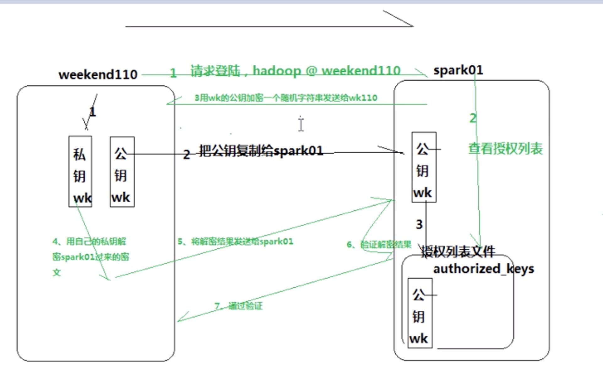

# hadoop入门

## 1、hadoop应用场景

​				专为离线的大规模数据分析的工具，常用于分析日志。电商，在线旅游等行业均有用到

## 2、对海量数据的处理思路

​				分布式计算，单台机器上的程序扩展到多台机器上并行运行。hadoop把计算任务分发给各个节点去计算，然后汇总。可以节约大把时间。

## 3、版本选择，以及安装

​				Hadoop除了Apache这个版本，很多第三方的版本

​				Apache复杂，灵活，运维较麻烦

​				第三方部署简单，死板，更新版本不方便

## 4、伪分布式与分布式配置区别

​				slave文件定义其他机器

## 5、hdfs的shell操作

​				put，get，ls 等操作，一般开发中不会用到

## 6、无密码登陆

​				公钥，私钥机制(rsa)

​				原理如图：

​				具体操作：[http://www.cnblogs.com/jdksummer/articles/2521550.html](http://www.cnblogs.com/jdksummer/articles/2521550.html)

## 7、hdfs文件上传流程

 　  1.客户端想NameNode申请上传文件，

　　2.NameNode返回此次上传的分配DataNode情况给客户端

　　3.客户端开始依向dataName上传对应的block数据块。

　　4.上传完成之后通知namenode，namenode利用pipe管道机制进行文件的备份，也就是一个集群中文件有好几个副本。

　　5.如果备份失败会将失败信息返回给namenode然后重新分配备节点，并利用pipe管道备份文件

## 8、NameNode管理元数据的机制

 

 **过程:**

　　1.客户端上传文件时，首先向NameNode申请上传文件

　　2.NameNode首先往edit logs记录元数据操作日志(也就是记录block分配情况等数据)

　　3.NameNode将文件上传分配blk情况返回给客户端

　　4.客户端向dateNode上传文件

　　5.上传成功之后，客户端通知namenode文件上传完成

　　6.namenode将本次分配的日志信息读取到内存中(内存中记录最新的文件上传的元数据)，

　　7.为了防止内存数据丢失，需要将元数据进行持久化操作。每当editlogs快要写满时将这一段时间的log写入到fsimage中

## 9、NameNode将元数据持久化到磁盘的过程

**过程:(为了防止进行editlog和fsimage合并浪费内存，因此将合并文件的操作在secondnode中进行)**

　　1.当editlogs快要满的时候namenode通知secondnode进程checkpoint操作(合并操作)

　　2.secondnode收到通知后通知namenode停止向editlogs写日志，

　　3.此时为了不影响客户端继续上传文件，namenode新创一个文件叫做edits.new记录代替editlogs记录日志操作

　　4.secondnode将fsimage和editlogs下载进行合并，由于hadoop集成了jetty插件，因此通过http协议下载文件

　　5.下载完成之后secondnode利用自己的CPU，将editlogs按照fsimage的格式进行计算之后合并到fsimage完成合并，并将文件重命名为fsimage.chkpoint

　　6.合并完成之后上传给namenode。namenode删除原来的fsimage和edits，并将edits.new重命名为editlogs，将fsimage.chkpoint重新命名为fsimage。就可以进行正常的hdfs机制

## 10、DateNode工作机制

​				使用cat   >>  命令。可以还原切割前的文件。

​				且tar -zxvf 不需要文件名为tar。gz结尾。只需是tar文件即可。